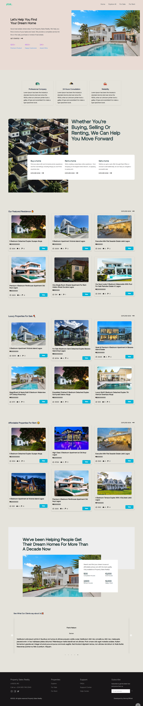
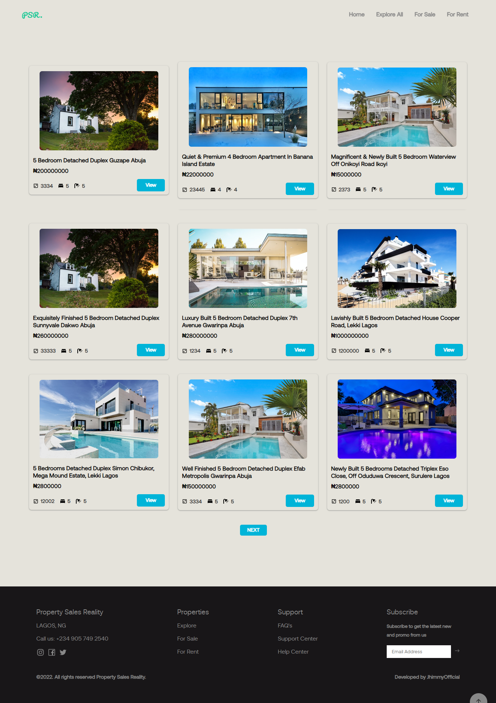

 # Property Sales Reality - A Real-Estate Company.

This project's major objective was to display available properties that were listed in Lagos, Nigeria. Properties can be filtered by the following criteria: luxury, featured, for sale, and for rent. Additionally, it has a page called the "admin dashboard" that acts as the app's content management system. Firebase and React.Js were used to build this project.

## Table of contents

- [Overview](#overview)
  - [The Project](#the-project)
  - [Links](#links)
- [My process](#my-process)
  - [Built with](#built-with)
- [Author](#author)

## Overview

### The Project

Major Components of the Project includes

- Optimal layout for the site depending on user's device's screen size
- User Authentication
- User Authorization
- Responsive Maps
- Interactive Animations
- CRUD (Create, Read, Update and Delete) Operations with Firebase

### Links

- Live Site URL: https://propertysalesreality.netlify.app/

### Images of the project

### Built with

- React.Js
- Firebase
- Redux
- React Router
- CSS Media Queries
- Mobile-first workflow
- Leaflet for Map
- [React Slick](https://react-slick.neostack.com/) For Carousel

## Author

- Twitter - [@jhimmyofficial](https://www.twitter.com/@jhimmyofficial)

## Running the Project

The project was bootstrapped with [Create React App](https://github.com/facebook/create-react-app).

## Available Scripts

In the project directory, you can run:

### `npm start`

Runs the app in the development mode.\
Open [http://localhost:3000](http://localhost:3000) to view it in the browser.